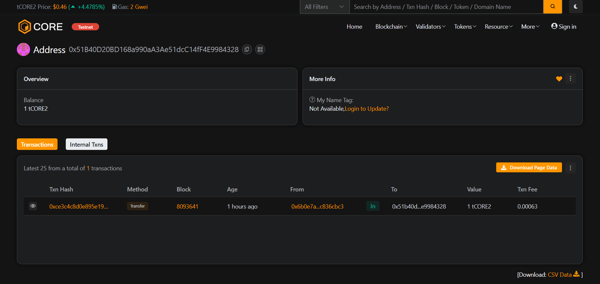

# DeVaultOS

### Project Description
DeVaultOS is a minimal, on-chain "vault operating system" that lets users store a single encrypted or hashed data pointer (bytes32) tied to their address. Data is kept off-chain (encrypted or archived) while a verification hash is stored on-chain for integrity and simple on-chain ownership semantics.

### Project Vision
Provide a lightweight, permissionless primitive for user-controlled off-chain data anchoring and simple vault transfers — enabling secure proofs of custody, recoverable data transfers, and composable primitives for dApps that need minimal on-chain storage.

### Key Features
- storeData(bytes32 dataHash) — store or update a bytes32 hash representing encrypted/off-chain data (caller-scoped).
- getData(address owner) view — retrieve the stored data hash for any address.
- transferOwnership(address newOwner) — atomically transfer stored data (hash) from sender to another address.
- Gas-conscious and intentionally small surface area to minimize attack surface and on-chain costs.

### Future Scope
- Add multi-slot vaults per user and versioning for audit/history.
- Integrate access control and recovery mechanisms (social recovery, guardians).
- Support pointers to IPFS/Arweave and optional encryption metadata.
- Add ERC‑721 wrapping for transferable vault tokens and timelocked vault transfers.
- Frontend utilities for secure key management and encrypted upload workflows.

### Contract address:
0x51B40D20BD168a990aA3Ae51dcC14fF4E9984328
